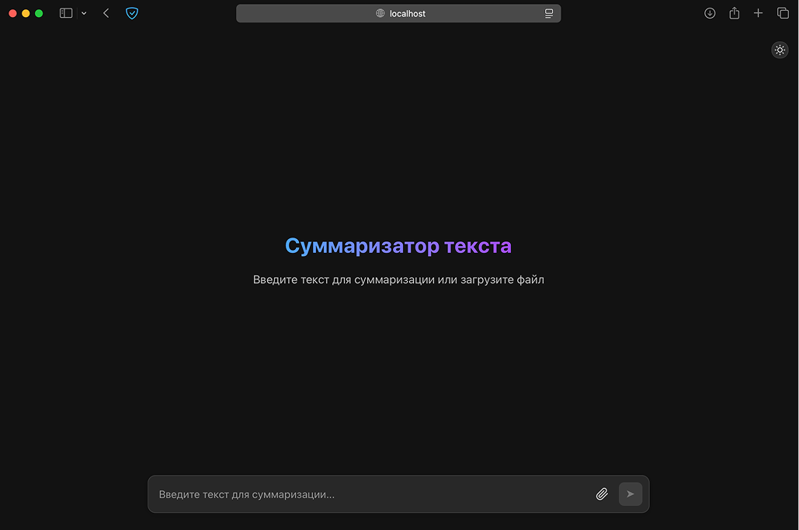
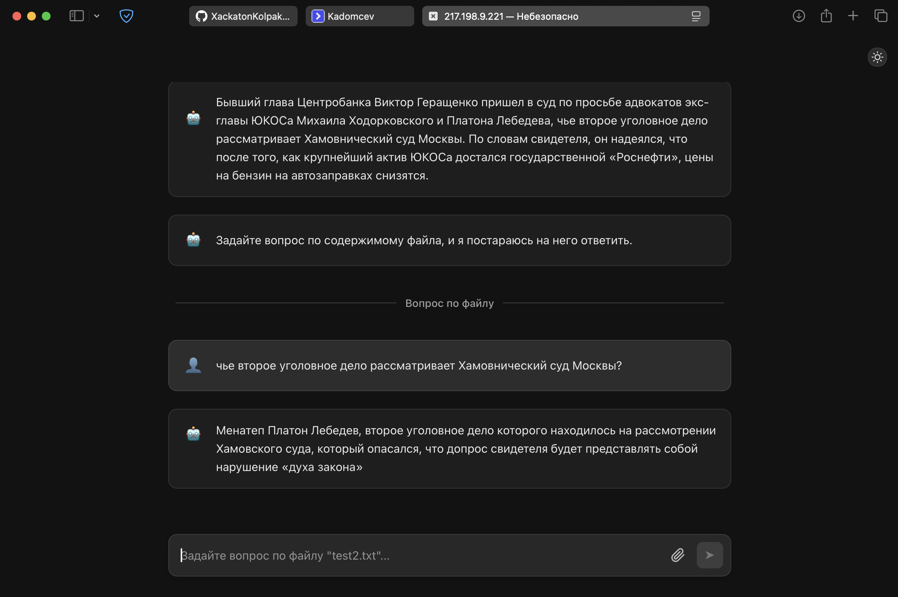
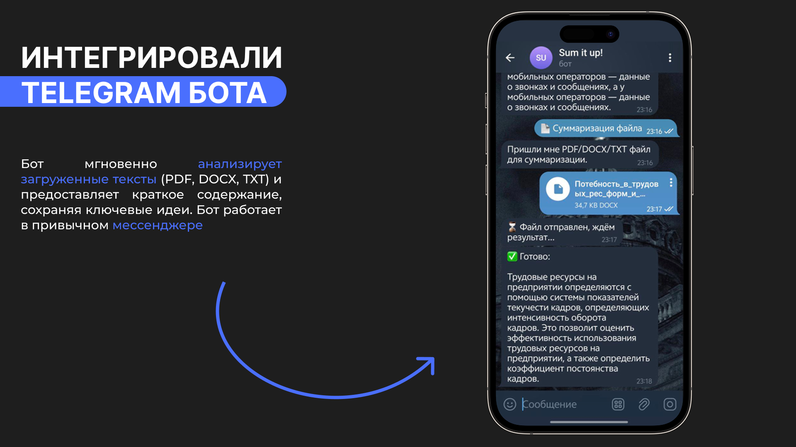
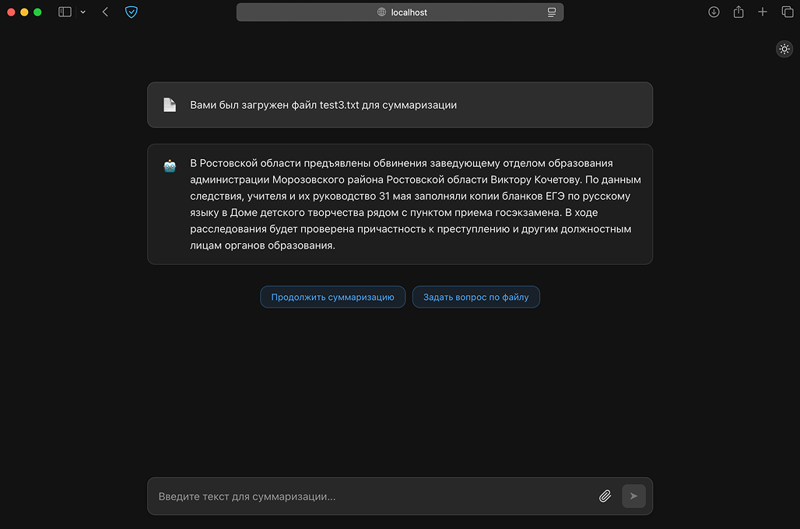

# Платформа для суммаризации текста с qa интеграцией



## 📋 Описание проекта

Система анализирует текст и генерирует краткое, но информативное содержание, сохраняя ключевые идеи. Пользователь может задавать вопросы по отправленному тексту и получать тематические ответы. Проект предназначен для тех, кто хочет экономить время на обработке больших объемов информации. Пользователи могут загружать тексты в различных форматах (например, PDF, DOCX, TXT) или просто вводить их вручную и получать переформулированный короткий текст.

### Ключевые возможности:

- 👥 Реализованна полноценная платформа для работы
- 📝 Суммаризация текста с пониманием контекста 
- 📰 Ответы на вопросы по отправленному пользователем тексту 
- 🔍 Персонализированные рекомендации на основе предпочтений пользователя
- 📱 Интеграция с Telegram для удобного взаимодействия с сервисом
- 📊 Разработан многоуровневый бэк с возможностью расширения

## 🚀 Технологии

- **Backend**: FastAPI, Kafka, Redis, ZooKeeper
- **ML сервисы (sum, qa)**: Torch, T5, Scikit-learn, Pandas, NumPy
- **Интеграция с мессенджерами**: python-telegram-bot
- **Работа с документами**: ReportLab (PDF), python-docx (DOCX)

## 📸 Скриншоты проекта

<details>
<summary>Нажмите, чтобы увидеть скриншоты</summary>


<p align="center"><em>Пример ответа на вопрос по предоставленному тексту</em></p>


<p align="center"><em>Телеграм бот тоже работает</em></p>


<p align="center"><em>Демонстрация суммаризации текста</em></p>

</details>

## 🏗️ Как запустить проект

```bash
git clone https://github.com/FlexonaFFt/Summary.git

cd Summary

docker compose build

docker compose up
```
